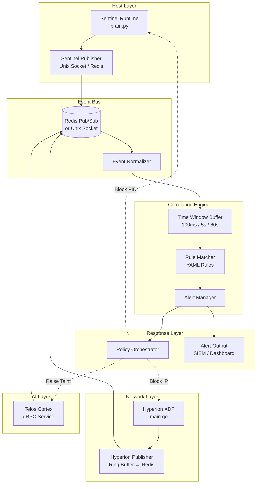

This document specifies a real-time threat correlation engine that unifies detection signals from Sentinel (host), Hyperion (network), and Telos (AI intent) to identify sophisticated multi-stage attacks.

> [!IMPORTANT]
> This is a **P0-critical** architecture document. Implementation requires coordinated changes across `sentinel-runtime` and `hyperion-xdp` repositories.

---

## Problem Statement

Each research track operates independently:

| Project | Detection Scope | Blind Spots |
|---------|-----------------|-------------|
| **Sentinel** | Syscall behavior | Network-only attacks, intent context |
| **Hyperion** | Network packets | Post-compromise host activity, semantic meaning |
| **Telos** | AI agent intent | Non-agent processes, raw network traffic |

**The Gap:** A coordinated attack that spans multiple layers may evade detection by each individual system while leaving traces visible only through correlation.

---

## System Architecture



---

## Event Exchange Protocol

### Option 1: Redis Pub/Sub (Recommended)

**Pros:** Cross-process, cross-host capable, built-in pub/sub, persistent option
**Cons:** External dependency, network latency

```
┌─────────────┐     PUBLISH      ┌─────────────┐     SUBSCRIBE     ┌─────────────┐
│  Sentinel   │ ───────────────► │    Redis    │ ◄─────────────── │ Correlation │
│  brain.py   │  sentinel:events │   Server    │  sentinel:events │   Engine    │
└─────────────┘                  └─────────────┘  hyperion:events  └─────────────┘
                                       ▲
┌─────────────┐     PUBLISH            │
│  Hyperion   │ ───────────────────────┘
│  main.go    │  hyperion:events
└─────────────┘
```

**Channels:**
- `sentinel:events` — Host syscall events
- `hyperion:events` — Network packet events
- `telos:events` — Intent/taint events
- `correlation:alerts` — Correlated threat alerts
- `policy:updates` — Dynamic policy pushes

### Option 2: Unix Domain Sockets (Low Latency)

**Pros:** Minimal latency (~1μs), no external dependency, kernel-optimized
**Cons:** Single-host only, requires custom multiplexing

```
/tmp/correlation/sentinel.sock  →  Correlation Engine
/tmp/correlation/hyperion.sock  →  Correlation Engine
/tmp/correlation/policy.sock    ←  Policy Updates
```

### Option 3: gRPC Streaming (Structured)

**Pros:** Type-safe (protobuf), bidirectional streaming, TLS support
**Cons:** Higher overhead than sockets, requires proto compilation

**Recommended for Telos integration** (already uses gRPC).

### Selected Approach: Hybrid

| Source | Protocol | Reason |
|--------|----------|--------|
| **Sentinel** | Unix Socket (local) or Redis (distributed) | Low latency for syscall events |
| **Hyperion** | Redis Pub/Sub | Ring buffer → userspace → Redis pipeline |
| **Telos** | gRPC Stream | Already implemented in TelosControl |
| **Correlation → Policy** | Redis Pub/Sub | Fan-out to multiple enforcers |

---

## Event Schemas

### Host Event (Sentinel)

```json
{
  "schema_version": "1.0",
  "event_type": "host",
  "event_id": "sentinel-1707234567-12345",
  "timestamp_ns": 1707234567123456789,
  "source": "sentinel",
  
  "process": {
    "pid": 12345,
    "ppid": 12340,
    "comm": "python3",
    "exe": "/usr/bin/python3",
    "cmdline": ["python3", "malware.py"],
    "uid": 1000,
    "gid": 1000
  },
  
  "syscall": {
    "nr": 257,
    "name": "openat",
    "verb": "open",
    "args": {
      "path": "/home/user/.ssh/id_rsa",
      "flags": "O_RDONLY",
      "fd": 3
    }
  },
  
  "verdict": {
    "action": "ALLOW",
    "reason": "no policy match",
    "latency_us": 150
  },
  
  "context": {
    "cwd": "/tmp",
    "tty": "pts/0",
    "session_id": "sess-abc123"
  }
}
```

### Network Event (Hyperion)

```json
{
  "schema_version": "1.0",
  "event_type": "network",
  "event_id": "hyperion-1707234567-67890",
  "timestamp_ns": 1707234567123456789,
  "source": "hyperion",
  
  "connection": {
    "src_ip": "192.168.1.100",
    "src_port": 54321,
    "dst_ip": "185.220.101.42",
    "dst_port": 443,
    "protocol": "TCP",
    "direction": "EGRESS"
  },
  
  "packet": {
    "len": 1420,
    "payload_hash": "sha256:abc123...",
    "payload_preview_b64": "R0VUIi8gSFRUUC8x...",
    "tcp_flags": ["SYN", "ACK"],
    "seq": 123456789
  },
  
  "inspection": {
    "dpi_mode": "FULL",
    "signature_match": null,
    "threat_score": 0.35,
    "flow_id": "flow-xyz789"
  },
  
  "verdict": {
    "action": "PASS",
    "xdp_action": "XDP_PASS",
    "reason": "no signature match",
    "latency_ns": 136
  }
}
```

### Unified Correlation Event

```protobuf
syntax = "proto3";

package correlation;

import "google/protobuf/timestamp.proto";

// Unified event wrapper for correlation engine
message CorrelationEvent {
  string event_id = 1;
  google.protobuf.Timestamp timestamp = 2;
  EventSource source = 3;
  
  oneof payload {
    HostEvent host = 10;
    NetworkEvent network = 11;
    IntentEvent intent = 12;
  }
}

enum EventSource {
  SOURCE_UNKNOWN = 0;
  SOURCE_SENTINEL = 1;
  SOURCE_HYPERION = 2;
  SOURCE_TELOS = 3;
}

message HostEvent {
  int32 pid = 1;
  int32 ppid = 2;
  string comm = 3;
  string syscall_name = 4;
  string syscall_verb = 5;  // Normalized: "open", "exec", "connect", "unlink"
  map<string, string> args = 6;
  string verdict = 7;
}

message NetworkEvent {
  string src_ip = 1;
  string dst_ip = 2;
  int32 src_port = 3;
  int32 dst_port = 4;
  string protocol = 5;
  string direction = 6;  // INGRESS, EGRESS
  bytes payload_hash = 7;
  float threat_score = 8;
  string verdict = 9;
}

message IntentEvent {
  string agent_id = 1;
  string goal = 2;
  repeated string planned_actions = 3;
  bool verified = 4;
  string taint_level = 5;  // NONE, LOW, MEDIUM, HIGH, CRITICAL
}
```

---

## Correlation Rules

### Rule 1: C2 Beacon + Sensitive File Access

**Threat Model:** Malware establishes C2 connection, then accesses sensitive files for exfiltration.

```yaml
rule:
  id: c2_beacon_sensitive_file
  name: "C2 Beacon with Sensitive File Access"
  description: "Detects C2 channel establishment followed by sensitive file read"
  severity: CRITICAL
  mitre_attack:
    - T1071.001  # Web Protocols
    - T1005      # Data from Local System
  
  window: 30s
  
  conditions:
    - event: network
      alias: c2_connection
      match:
        direction: EGRESS
        dst_port: [80, 443, 8080, 8443]
        threat_score: ">= 0.3"
      
    - event: host
      alias: sensitive_read
      after: c2_connection
      within: 30s
      match:
        syscall_verb: open
        args.path:
          regex: "(/etc/passwd|/etc/shadow|.ssh/|.gnupg/|.aws/|.kube/)"
        
    - correlation:
        # Same process tree
        sensitive_read.ppid: "in_process_tree(c2_connection.pid)"
  
  actions:
    - alert:
        severity: CRITICAL
        message: "C2 beacon detected with subsequent sensitive file access"
        include_events: [c2_connection, sensitive_read]
    - policy:
        sentinel: { block_pid: "$sensitive_read.pid" }
        hyperion: { block_ip: "$c2_connection.dst_ip" }
```

### Rule 2: Simultaneous Host Execution + Network Callback

**Threat Model:** Dropper downloads payload, executes it, payload calls back to C2.

```yaml
rule:
  id: download_execute_callback
  name: "Download-Execute-Callback Chain"
  description: "Detects file download, execution, and immediate network callback"
  severity: HIGH
  mitre_attack:
    - T1105  # Ingress Tool Transfer
    - T1059  # Command and Scripting Interpreter
    - T1071  # Application Layer Protocol
  
  window: 60s
  
  conditions:
    - event: network
      alias: download
      match:
        direction: INGRESS
        protocol: TCP
        packet.len: ">= 1000"  # Significant payload
        
    - event: host
      alias: file_write
      after: download
      within: 5s
      match:
        syscall_verb: write
        args.path:
          regex: "(/tmp/|/var/tmp/|/dev/shm/)"
        
    - event: host
      alias: execution
      after: file_write
      within: 10s
      match:
        syscall_verb: exec
        args.path: "$file_write.args.path"
        
    - event: network
      alias: callback
      after: execution
      within: 30s
      match:
        direction: EGRESS
        src_pid: "$execution.pid"
  
  actions:
    - alert:
        severity: HIGH
        message: "Potential dropper: download → execute → callback detected"
        include_events: [download, file_write, execution, callback]
    - policy:
        sentinel: { kill_process: "$execution.pid" }
        hyperion: { block_ip: "$callback.dst_ip", block_ip: "$download.src_ip" }
```

### Rule 3: Process Tree Evasion with Exfiltration

**Threat Model:** Malware forks/clones to evade monitoring, child performs exfiltration.

```yaml
rule:
  id: fork_evasion_exfil
  name: "Process Evasion with Data Exfiltration"
  description: "Detects fork/clone evasion followed by network exfiltration from child"
  severity: CRITICAL
  mitre_attack:
    - T1055  # Process Injection (evasion variant)
    - T1048  # Exfiltration Over Alternative Protocol
  
  window: 10s
  
  conditions:
    - event: host
      alias: parent_spawn
      match:
        syscall_verb: fork  # Includes clone, vfork
        
    - event: host
      alias: child_file_access
      after: parent_spawn
      within: 5s
      match:
        syscall_verb: open
        pid: "$parent_spawn.child_pid"
        args.flags: "O_RDONLY"
        args.path:
          not_regex: "^(/usr/|/lib/|/proc/)"  # Exclude system paths
        
    - event: network
      alias: child_network
      after: child_file_access
      within: 5s
      match:
        direction: EGRESS
        src_pid: "$parent_spawn.child_pid"
        packet.len: ">= 500"  # Significant data transfer
  
  actions:
    - alert:
        severity: CRITICAL
        message: "Evasion detected: forked child reading files and sending data"
        include_events: [parent_spawn, child_file_access, child_network]
    - policy:
        sentinel: { block_pid: "$parent_spawn.pid", block_pid: "$parent_spawn.child_pid" }
        hyperion: { block_ip: "$child_network.dst_ip" }
```

### Rule 4: Taint-Driven AI Agent Exfiltration (Telos Integration)

**Threat Model:** AI agent receives prompt injection, attempts to exfiltrate data.

```yaml
rule:
  id: taint_agent_exfil
  name: "Prompt Injection to Agent Exfiltration"
  description: "Detects tainted AI agent attempting data exfiltration"
  severity: CRITICAL
  mitre_attack:
    - T1566  # Phishing (prompt injection variant)
    - T1048  # Exfiltration
  
  window: 5s
  
  conditions:
    - event: intent
      alias: taint_detected
      match:
        taint_level: [MEDIUM, HIGH, CRITICAL]
        
    - event: host
      alias: agent_file_access
      after: taint_detected
      within: 2s
      match:
        syscall_verb: open
        comm: { in: [python3, node, claude, cursor] }  # AI agent processes
        args.path:
          regex: "(.ssh/|.gnupg/|.env|credentials|secret)"
        
    - event: network
      alias: agent_exfil
      after: agent_file_access
      within: 3s
      match:
        direction: EGRESS
  
  actions:
    - alert:
        severity: CRITICAL
        message: "Tainted AI agent attempting credential exfiltration"
    - policy:
        sentinel: { block_pid: "$agent_file_access.pid" }
        hyperion: { block_ip: "$agent_exfil.dst_ip" }
        telos: { suspend_agent: true, max_taint: CRITICAL }
```

---

## Implementation: Code Changes

### Sentinel: `brain.py` Modifications

**File:** `sentinel-runtime/src/analysis/brain.py`

```python
# === ADD: Correlation Engine Integration ===

import redis
import json
import time
from dataclasses import dataclass, asdict
from typing import Optional

@dataclass
class HostEvent:
    """Event structure for correlation engine."""
    event_id: str
    timestamp_ns: int
    pid: int
    ppid: int
    comm: str
    syscall_name: str
    syscall_verb: str
    args: dict
    verdict: str
    
class CorrelationPublisher:
    """Publishes host events to Redis for correlation."""
    
    def __init__(self, redis_host: str = "localhost", redis_port: int = 6379):
        self.redis = redis.Redis(host=redis_host, port=redis_port, decode_responses=True)
        self.channel = "sentinel:events"
        self.event_counter = 0
        
    def publish_event(self, verb: str, args: dict, pid: int, ppid: int, 
                      comm: str, verdict: str) -> None:
        """Publish syscall event to correlation engine."""
        self.event_counter += 1
        event = HostEvent(
            event_id=f"sentinel-{int(time.time())}-{self.event_counter}",
            timestamp_ns=time.time_ns(),
            pid=pid,
            ppid=ppid,
            comm=comm,
            syscall_name=args.get("syscall", "unknown"),
            syscall_verb=verb,
            args=args,
            verdict=verdict
        )
        self.redis.publish(self.channel, json.dumps(asdict(event)))
        
    def subscribe_policy_updates(self, callback) -> None:
        """Subscribe to policy updates from correlation engine."""
        pubsub = self.redis.pubsub()
        pubsub.subscribe("policy:sentinel")
        for message in pubsub.listen():
            if message["type"] == "message":
                policy = json.loads(message["data"])
                callback(policy)


# === MODIFY: Integrate into existing Brain class ===

class Brain:
    def __init__(self):
        self.protected_paths = [...]  # existing
        self.correlation = CorrelationPublisher()  # ADD THIS
        
    def analyze(self, verb: str, argument: str, pid: int, ppid: int) -> str:
        """Analyze syscall and return verdict."""
        verdict = self._check_policy(verb, argument)
        
        # ADD: Publish to correlation engine
        self.correlation.publish_event(
            verb=verb,
            args={"path": argument},
            pid=pid,
            ppid=ppid,
            comm=self._get_comm(pid),
            verdict=verdict
        )
        
        return verdict
```

### Hyperion: `main.go` Modifications

**File:** `hyperion-xdp/src/user/main.go`

```go
// === ADD: Correlation Engine Integration ===

package main

import (
    "context"
    "encoding/json"
    "fmt"
    "time"
    
    "github.com/redis/go-redis/v9"
)

// NetworkEvent represents a packet event for correlation
type NetworkEvent struct {
    EventID     string            `json:"event_id"`
    TimestampNs int64             `json:"timestamp_ns"`
    Source      string            `json:"source"`
    Connection  ConnectionInfo    `json:"connection"`
    Packet      PacketInfo        `json:"packet"`
    Inspection  InspectionResult  `json:"inspection"`
    Verdict     VerdictInfo       `json:"verdict"`
}

type ConnectionInfo struct {
    SrcIP     string `json:"src_ip"`
    SrcPort   int    `json:"src_port"`
    DstIP     string `json:"dst_ip"`
    DstPort   int    `json:"dst_port"`
    Protocol  string `json:"protocol"`
    Direction string `json:"direction"`
}

type PacketInfo struct {
    Len         int      `json:"len"`
    PayloadHash string   `json:"payload_hash"`
    TCPFlags    []string `json:"tcp_flags"`
}

type InspectionResult struct {
    DPIMode        string  `json:"dpi_mode"`
    SignatureMatch *string `json:"signature_match"`
    ThreatScore    float32 `json:"threat_score"`
    FlowID         string  `json:"flow_id"`
}

type VerdictInfo struct {
    Action    string `json:"action"`
    XDPAction string `json:"xdp_action"`
    Reason    string `json:"reason"`
    LatencyNs int64  `json:"latency_ns"`
}

// CorrelationPublisher handles event publishing to Redis
type CorrelationPublisher struct {
    client  *redis.Client
    channel string
    counter int64
}

func NewCorrelationPublisher(redisAddr string) *CorrelationPublisher {
    return &CorrelationPublisher{
        client: redis.NewClient(&redis.Options{
            Addr: redisAddr,
        }),
        channel: "hyperion:events",
        counter: 0,
    }
}

func (p *CorrelationPublisher) PublishEvent(ctx context.Context, event NetworkEvent) error {
    p.counter++
    event.EventID = fmt.Sprintf("hyperion-%d-%d", time.Now().Unix(), p.counter)
    event.TimestampNs = time.Now().UnixNano()
    event.Source = "hyperion"
    
    data, err := json.Marshal(event)
    if err != nil {
        return err
    }
    
    return p.client.Publish(ctx, p.channel, data).Err()
}

func (p *CorrelationPublisher) SubscribePolicyUpdates(ctx context.Context, 
    callback func(policy map[string]interface{})) {
    
    pubsub := p.client.Subscribe(ctx, "policy:hyperion")
    ch := pubsub.Channel()
    
    for msg := range ch {
        var policy map[string]interface{}
        if err := json.Unmarshal([]byte(msg.Payload), &policy); err == nil {
            callback(policy)
        }
    }
}


// === MODIFY: Integrate into ring buffer handler ===

func (h *EventHandler) handleRingBufEvent(record *perf.Record) {
    event := parseXDPEvent(record.RawSample)
    
    // Existing logging...
    
    // ADD: Publish to correlation engine
    corrEvent := NetworkEvent{
        Connection: ConnectionInfo{
            SrcIP:     event.SrcIP.String(),
            DstIP:     event.DstIP.String(),
            SrcPort:   int(event.SrcPort),
            DstPort:   int(event.DstPort),
            Protocol:  "TCP",
            Direction: getDirection(event),
        },
        Packet: PacketInfo{
            Len:         int(event.PacketLen),
            PayloadHash: computeHash(event.Payload),
            TCPFlags:    parseTCPFlags(event.Flags),
        },
        Inspection: InspectionResult{
            DPIMode:     h.dpiMode,
            ThreatScore: event.ThreatScore,
            FlowID:      event.FlowID,
        },
        Verdict: VerdictInfo{
            Action:    event.Action,
            XDPAction: event.XDPAction.String(),
            LatencyNs: event.LatencyNs,
        },
    }
    
    if err := h.correlationPub.PublishEvent(h.ctx, corrEvent); err != nil {
        log.Warnf("Failed to publish correlation event: %v", err)
    }
}
```

---

## Implementation Roadmap

| Phase | Component | Repository | Files | Estimated Effort |
|-------|-----------|------------|-------|------------------|
| **1** | Event Schema | shared | `proto/correlation.proto` | 2 hours |
| **2** | Redis Publisher | sentinel-runtime | `src/analysis/brain.py` | 4 hours |
| **3** | Redis Publisher | hyperion-xdp | `src/user/main.go` | 4 hours |
| **4** | Correlation Engine | new repo / shared | `correlation/engine.py` | 8 hours |
| **5** | Rule Parser | correlation engine | `correlation/rules.py` | 4 hours |
| **6** | Policy Orchestrator | correlation engine | `correlation/policy.py` | 4 hours |
| **7** | Integration Testing | all | `tests/integration/` | 8 hours |

**Total Estimated Effort:** ~34 hours

---

## Deployment Architecture

```
┌─────────────────────────────────────────────────────────────────┐
│                         Host Machine                            │
│                                                                 │
│  ┌─────────────────┐    ┌─────────────────┐    ┌─────────────┐ │
│  │ Sentinel        │    │ Hyperion XDP    │    │ Redis       │ │
│  │ (User Space)    │    │ (User Space)    │    │ Server      │ │
│  │                 │    │                 │    │             │ │
│  │ brain.py        │───►│ main.go         │───►│ :6379       │ │
│  │ + Correlation   │    │ + Correlation   │    │             │ │
│  │   Publisher     │    │   Publisher     │    │             │ │
│  └─────────────────┘    └─────────────────┘    └──────┬──────┘ │
│                                                       │        │
│  ┌────────────────────────────────────────────────────▼──────┐ │
│  │                  Correlation Engine                       │ │
│  │  ┌──────────┐  ┌──────────┐  ┌──────────┐  ┌──────────┐  │ │
│  │  │ Event    │  │ Time     │  │ Rule     │  │ Alert    │  │ │
│  │  │ Ingester │─►│ Window   │─►│ Matcher  │─►│ Manager  │  │ │
│  │  └──────────┘  └──────────┘  └──────────┘  └──────────┘  │ │
│  └───────────────────────────────────────────────────────────┘ │
└─────────────────────────────────────────────────────────────────┘
```

---

## Future Considerations

- **Machine Learning:** Replace static rules with learned correlation patterns
- **Distributed Deployment:** Scale correlation across multiple hosts via Redis Cluster
- **Forensic Mode:** Offline correlation for incident investigation using event replay
- **SIEM Integration:** Export correlated alerts to Splunk/Elastic via Logstash
- **eBPF Acceleration:** Move hot-path correlation logic into kernel via eBPF maps
