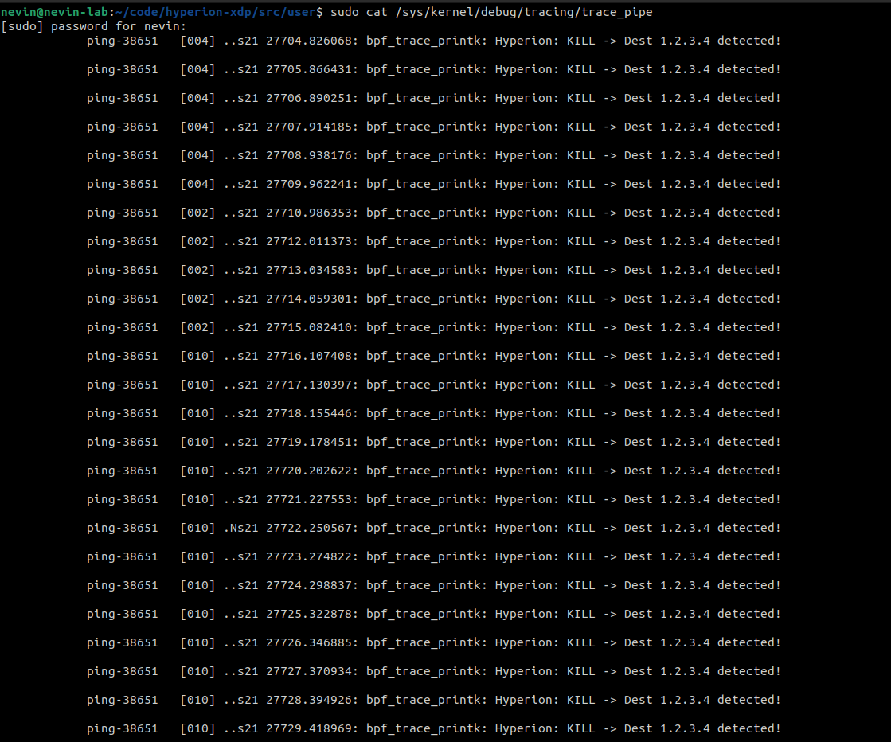

## 1. Objective
The goal of Milestone M1 was to establish a functional **XDP (Express Data Path)** hook capable of inspecting packet headers and issuing verdict codes (`XDP_DROP` / `XDP_PASS`) before the kernel allocates an `sk_buff`.

**Key Capabilities:**
* Attach BPF bytecode to the Loopback interface (`lo`).
* Parse Ethernet (`ethhdr`) and IP (`iphdr`) structures.
* Identify specific traffic patterns (Destination IP).
* Emit debug telemetry via `/sys/kernel/debug/tracing/trace_pipe`.

---

## 2. Implementation Logic

The core logic resides in `src/kern/hyperion_core.c`. We utilize direct pointer arithmetic to validate protocol headers against the strict eBPF verifier constraints.

```c
/* Hyperion M1 Logic: Destination Filtering */
if (ip->daddr == 0x04030201) { // Checks for 1.2.3.4 (Big Endian)
    bpf_printk("Hyperion: KILL -> Dest 1.2.3.4 detected!\n");
    return XDP_DROP;
}

```

This logic executes in the **Network Driver Interrupt Context**, ensuring minimal latency.

---

## 3. Verification & Evidence

**Test Procedure:**

1. **Loader:** `sudo ./hyperion_ctrl` (Attaches XDP program).
2. **Generator:** `ping -I lo 1.2.3.4` (Generates synthetic traffic).
3. **Observer:** `sudo cat /sys/kernel/debug/tracing/trace_pipe`.

**Result:**
The trace pipe confirmed successful interception and dropping of packets destined for `1.2.3.4`.

*Figure 1: Live capture of the Linux Kernel Trace Pipe showing Hyperion enforcing the drop verdict.*



---

## 4. Performance Note

Unlike `iptables`, which processes packets after memory allocation, Hyperion discarded these packets **without** traversing the full networking stack. This confirms the "Early Drop" architectural advantage.

**Status:** **M1 COMPLETE**
