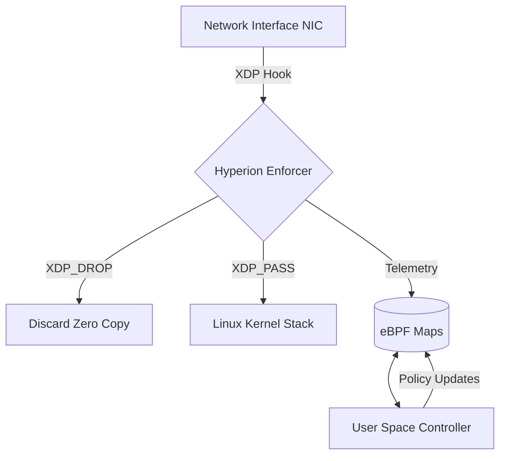

## Research Motivation

**Hyperion** explores the unification of process-level and packet-level defense. It serves as the **Network Satellite** to the Sentinel Runtime.

While Sentinel enforces policy at the *System Call* boundary (High Level), Hyperion enforces policy at the *Network Interface* boundary (Low Level).

> **The Research Question:** *Can security policy be enforced at wire speed, retaining temporal context, before the Operating System commits resources?*

---

## The "Two Towers" Architecture

Hyperion complements Sentinel by securing the transport boundary.

| Dimension | Track 1: Sentinel (Host) | Track 2: Hyperion (Wire) |
| :--- | :--- | :--- |
| **Boundary** | Process Execution | Network Transport |
| **Mechanism** | `ptrace` / Kernel Modules | `eBPF` / `XDP` |
| **Visibility** | Syscalls (`execve`, `open`) | Packets (`SYN`, `payload`) |
| **Constraint** | Context-Aware Logic | Sub-microsecond Latency |
| **Threats** | Ransomware, Droppers | DDoS, C2 Beacons |

---

## System Design (Split-Plane)

Hyperion operates on a split-plane design, utilizing the driver's interrupt context for maximum throughput.

### 1. Kernel Enforcer (`src/kern/`)

* **Technology:** Restricted C (eBPF).
* **Role:** Parses Ethernet/IP/TCP headers and applies verdicts.
* **Performance:** Operates in the driver's native execution path.

### 2. User Space Controller (`src/user/`)

* **Technology:** Go (using `cilium/ebpf`).
* **Role:** Loads BPF programs, manages Map lifecycles (Hash/LRU), and exports telemetry to the Sentinel Runtime.

---

## Current Status: Phase M1

Hyperion is currently in **Phase M1 (Stateless Ingress Filtering)**.

* **Capability:** High-performance dropping based on L3/L4 headers.
* **Validation:** Verified via Kernel Trace Logs (`bpf_trace_printk`).
* **Next Step:** Phase M2 (Temporal State Tracking).

