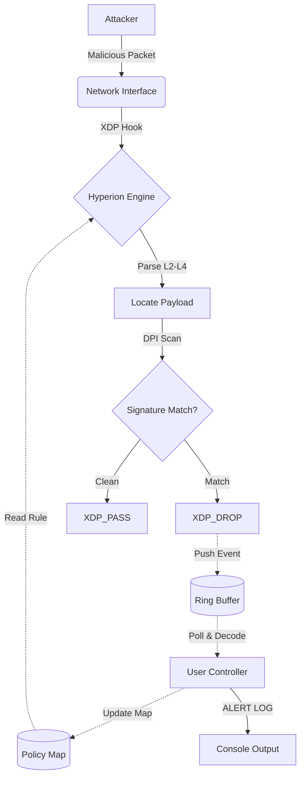

## Research Motivation
**Hyperion** explores the unification of process-level and packet-level defense. It serves as the **Network Satellite** to the Sentinel Runtime.

> **The Research Question:** *Can we inspect packet payloads for malicious signatures at wire speed, retaining temporal context, before the Operating System commits resources?*

---

## System Design (M4.6 Architecture)

Hyperion M4.6 operates on a fully dynamic split-plane design.

---

## Research Roadmap

We define success through distinct capability milestones.

### [Phase M1] Stateless Filtering (Complete)

* **Goal:** High-performance dropping based on L3/L4 headers.

### [Phase M2] Stateful Tracking (Complete)

* **Goal:** Volumetric DoS mitigation using `LRU_HASH` maps.

### [Phase M3] Deep Packet Inspection (Complete)

* **Goal:** Layer 7 Payload Analysis (Static).
* **Outcome:** Validated "Static Scanner" against hardcoded signatures.

### [Phase M4] Dynamic Policy (Complete)

* **Goal:** Production-grade Controller & Telemetry.
* **Status:** **vM4.6 Stable**. Features `RingBuf` logging, `SIGHUP` reloading, and Go-based CLI.

### [Phase M5] Flow Context (Current Research)

* **Goal:** Thesis-level research into **Stateful Flow Tracking**.
* **Objective:** Detect "Split-Packet" evasion attacks by reconstructing TCP context in XDP.

